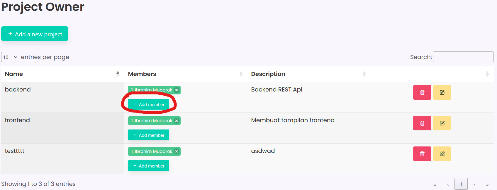
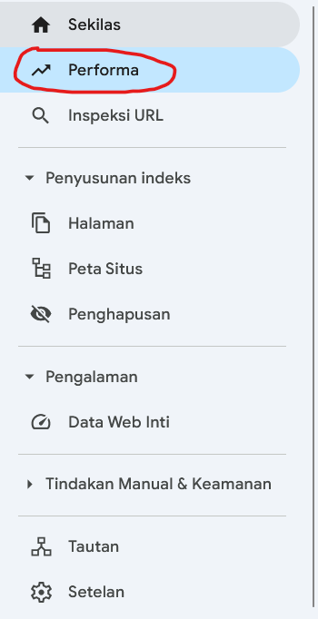
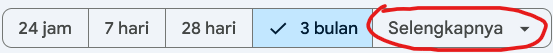
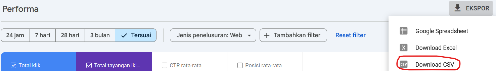

# tracker
Tracker adalah solusi yang dirancang untuk melacak unique visitor harian. Dengan menggunakan script ini, Anda dapat mengumpulkan data unique visitor seperti alamat IP, hostname, dan informasi browser pengguna yang mengakses website Anda.

# Cara implementasi
Penggunaan dapat dilakukan dengan mudah, hanya dengan meletakkan script di bagian header tag web anda
```
<script type="module" src="https://cdn.jsdelivr.net/gh/domyid/tracker@main/index.js"></script>
```

# 📦 Panduan Mendaftarkan Tracker ke Dashboard

Ikuti langkah-langkah berikut untuk mendaftarkan tracker di platform **do.my.id**:

---

## 1. Login ke Aplikasi

Masuk ke aplikasi melalui tautan berikut:

👉 [https://do.my.id](https://do.my.id)


---

## 2. Buka Menu Owner

Setelah berhasil login, buka menu **Owner** yang berada di bagian sidebar dalam kategori **Proyek**.


---

## 3. Buat project baru atau edit project yang sudah ada

Jika ingin membuat project baru pilih tombol **+ Add a new project** tetapi jika ingin mendaftarkan hostname menggunakan project yang sudah ada pilih tombol yang bericon **Pensil**.


---

## 4. Isi Kolom Project Hostname

Isi form project seperti mengisi project biasanya, bedanya jika anda ingin mendaftarkan tracker anda harus mengisi kolom **Project Hostname**. Dari mana mendapatkan hostname? Hostname adalah kombinasi dari subdomain(jika ada)+domain+TLD. Contohnya jika saya mendaftarkan tracker di website https://www.do.my.id/dashboard, maka hostname saya adalah do.my.id


---

## 5. Daftarkan Nomor Whatsapp

Langkah terakhir adalah mendaftarkan **nomor WhatsApp setiap user yang terlibat dalam proyek**, termasuk **nomor Anda sendiri**.

> ⚠️ **Penting:**  
> Saat Anda membuat project, sistem akan secara otomatis mendaftarkan Anda sebagai **Owner**, bukan **Member**.  
> Namun, **tracker hanya membaca data dari Member**, bukan Owner.

Klik tombol **+ Add member** dan isi form **Nomor Telepon Calon Member**



---

Dengan mengikuti langkah-langkah di atas, kamu akan dapat mendaftarkan tracker ke dashboad **do.my.id**.

# 📊 Panduan Melihat Data Unique Visitor

Ikuti langkah-langkah berikut untuk melihat data *unique visitor* menggunakan line chart di platform **do.my.id**:

---

## 1. Login ke Aplikasi

Masuk ke aplikasi melalui tautan berikut:

👉 [https://do.my.id](https://do.my.id)


---

## 2. Buka Menu Tracker

Setelah berhasil login, buka menu **Tracker** yang berada di bagian sidebar dalam kategori **Proyek**.


---

## 3. Pilih Rentang Tanggal

Gunakan pemilih tanggal untuk memilih **range waktu** yang ingin kamu tampilkan datanya dalam bentuk **line chart**.


---

Dengan mengikuti langkah-langkah di atas, kamu akan dapat melihat visualisasi *unique visitor* berdasarkan waktu yang dipilih.

# Panduan Export Data Google Search Console

Ikuti langkah-langkah berikut untuk mengambil data dari Google Search Console:

---

## 1. Menu Performa

Data dapat didapatkan di menu performa:



---

## 2. Rentang Waktu

Pilih selengkapnya dan rentang waktu dari tanggal 2025-06-01 samapi dengan tanggal 2025-06-30:




---

## 3. Export

Tekan tombol export kemudian pilih Download CSV, nanti akan ada pilihan untuk mendownload file dalam format zip yang berisi file csv:



---